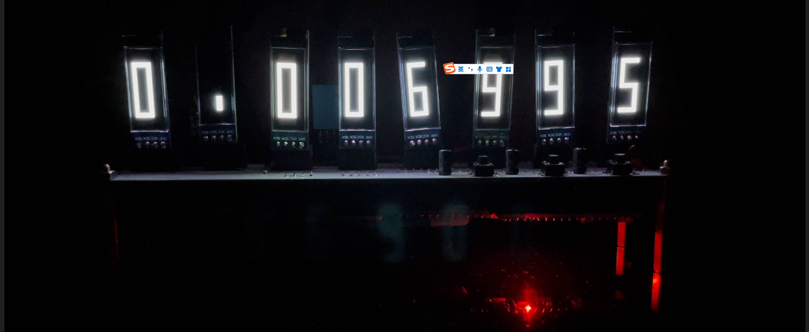
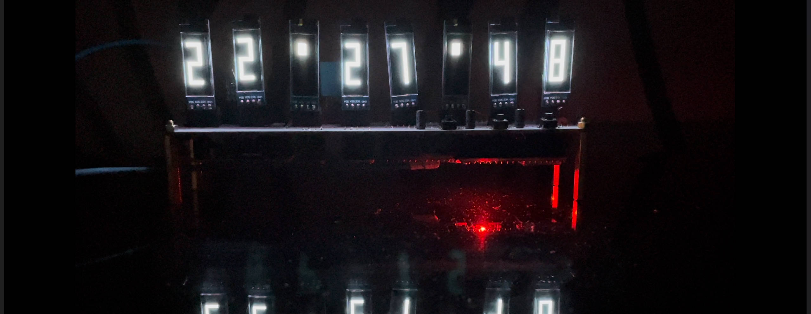
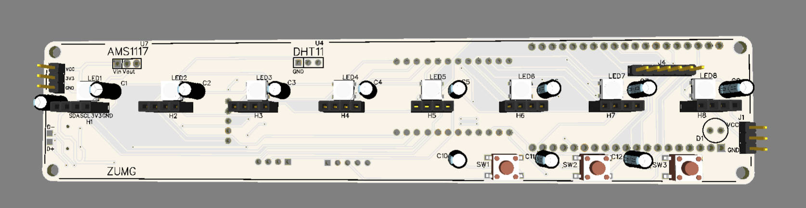
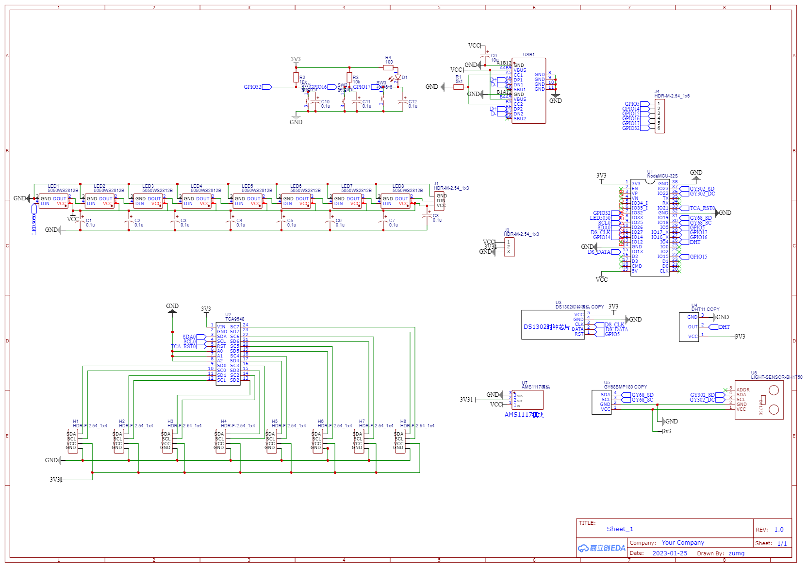

## World-Function Machine
## 世界线变动率测试仪

### 功能
+ 世界线变动率测试仪（随机数生成器）
+ WIFI联网校时
+ 可暂停的计时器
+ 时钟
+ 显示传感器测得数据  

### 更新
+ 2023-3-5 新增手机WiFi配网，但是esp32s内存不够没有跑起来。

### 说明
+ 上电会进入【时钟，世界线变动率测试仪，计时器，测试模式】中一个模式，按key1切换模式。
+ 计时器按key3开始/清零，计时器按key2暂停
+ 时钟模式大概每20s显示一次【温度，气压，湿度，亮度】，按key2会直接开始显示【温度，气压，湿度，亮度】。   
+ 上电后会显示动画，对时。
+ key3和led灯连接，按下led会亮。
+ 世界线变动率测试仪模式下，led会闪，来指示它在探索世界线，所以key3不能按。此外key2无作用。  

需要手动在```db.txt```中填入ssid和密码
```python
wlan.connect('ssid', 'passwd')
```
### 原理图&清单&图片
先看看世界线变动率测试仪！数字变化的时候一个直插3mmled会亮。

时钟，还会有传感器数据显示。

新做了计时器，还没有照片。

第一次画PCB，已经打了样，没有大问题。

原理图

### 清单
1. 0.91 OLED  8个
2. NODEMCU-ESP32S 开发板  1个
3. TCA9548A模块 1个
4. AMS1117 模块 1个
5. DHT11 模块 （四脚单模块，不要底板） 1个
6. GY-68 BMP180 模块 1个
7. GY-302 BH1750 模块 1个
8. DS1302 模块 1个
9. Type-C 全贴片 1个
10. 6*6轻触开关 3个
11. 10k 0603电阻 2个
12. 100Ω 0603电阻 1个
13. 5k1 0603电阻 1个
14. 直插4*7电容 0.1uf 8个
15. 5050LED WS2812B 8个
16. 直插3mm led 1个
17. 装饰用直插4*7电容 若干
18. 排针 排母 若干

### FORKS
1. ds1302.py https://github.com/omarbenhamid/micropython-ds1302-rtc
2. bh1750.py https://github.com/catdog2/mpy_bh1750fvi_esp8266
3. bmp085.py https://github.com/robert-hh/BMP085_BMP180
4. ssd1306.py https://github.com/adafruit/micropython-adafruit-ssd1306
5. microdot.py https://github.com/miguelgrinberg/microdot


